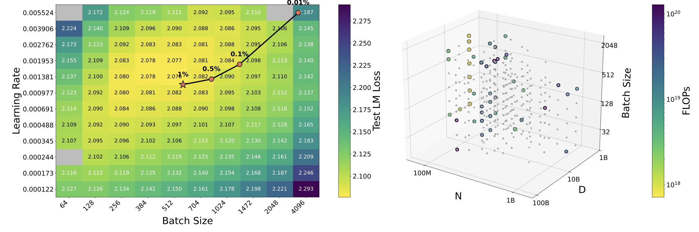

# Spend Less, Fit Better: Budget-Efficient Scaling Law Fitting via Active Experiment Selection

<p align="center">
  
</p>
<p align="center">
  <em>On <code>lr&bsz</code>, MSPE reaches the low-loss target region using only about 1% of the original fitting budget.</em>
</p>

> Given a pool of runnable experiments and a **limited budget**, how should we select experiments to ensure that the **fitted scaling law extrapolates accurately** in the target region?

[](https://arxiv.org/abs/2604.22753) [](https://huggingface.co/datasets/sijieli/scalebench) [](LICENSE)

This repository contains the core method and benchmark for **Spend Less, Fit Better: Budget-Efficient Scaling Law Fitting via Active Experiment Selection**. We formulate scaling-law fitting as a **budget-aware sequential design** problem: given a pool of candidate experiments with heterogeneous costs, select experiments sequentially to maximize extrapolation accuracy in a high-cost target region.

## Benchmark

This repo contains a benchmark for budget-aware scaling-law fitting with **8 tasks and 65 scaling-law instances**. Each instance defines:

- a parametric scaling-law family
- a candidate pool of runnable experiments `X_cand`
- a held-out high-cost target region `X_tar`
- a task-specific cost proxy

### Table 1. Benchmark Statistics

| Task | # Laws | Avg. Params | # Train | # Test | Target | Cost |
| --- | ---: | ---: | ---: | ---: | --- | --- |
| `parallel` | 10 | 4.2 | 36 | 12 | `L(N, P)` | `N` |
| `vocab` | 10 | 6.8 | 1080 | 120 | `L(N, V, D)` | `6ND` |
| `domain` | 10 | 29.0 | 504 | 42 | `{L_i(r)}_{i=1}^5` | `1` |
| `moe` | 10 | 5.3 | 193 | 28 | `L(N, E)` | `NE` |
| `data_con` | 10 | 7.0 | 161 | 21 | `L(N, D, U)` | `6ND` |
| `lr&bsz` | 10 | 20.2 | 2702 | 117 | `L(l, b, N, D)` | `6ND` |
| `sparsity` | 4 | 5.0 | 70 | 18 | `L(P, N_2)` | `6N_1D_1 + 6N_2D_2` |
| `farseer` | 1 | 9.0 | 404 | 7 | `L(N, D)` | `6ND` |

The corresponding datasets live under [`benchmark/dataset`](benchmark/dataset). The dataset names used by the code are:

- `parallel_scaling_law`
- `vocab_scaling_law`
- `domain_mixture_scaling_law`
- `moe_scaling_law`
- `data_constrained_scaling_law`
- `lr_bsz_scaling_law`
- `sparsity_scaling_law`
- `farseer_scaling_law`

## Results

The main result is that test $R^2$ consistently outperforms `Random`, `Cheapest`, `Cost Rand`, `D-opt`, and `V-opt` in low- and mid-budget regimes, and often approaches or exceeds the `All Data` fit on several tasks. We reproduce **Table 2** from the paper below.

Note: the table is written as `1% / 5% / 10%`, while the `domain` and `sparsity` columns correspond to `20% / 35% / 50%` in the paper.

<details>
<summary><strong>Table 2. Task-level target-region R²</strong></summary>

### 1% Budget

| Setting | lr&bsz | domain | vocab | parallel | moe | data_con | sparsity | farseer |
| --- | --- | --- | --- | --- | --- | --- | --- | --- |
| Random | **-0.65 ± 0.49** | -0.36 ± 0.82 | 0.54 ± 0.57 | -1.00 ± 0.00 | -0.47 ± 0.66 | -0.74 ± 0.48 | -0.25 ± 0.63 | -0.77 ± 0.55 |
| Cheapest | -0.92 ± 0.29 | -0.36 ± 0.82 | 0.30 ± 0.71 | -1.00 ± 0.00 | 0.30 ± 0.57 | -0.58 ± 0.64 | -0.95 ± 0.14 | -0.89 ± 0.17 |
| Cost Rand | -0.89 ± 0.31 | -0.36 ± 0.82 | 0.86 ± 0.38 | -1.00 ± 0.00 | -0.11 ± 0.70 | -0.38 ± 0.70 | -0.41 ± 0.52 | -0.25 ± 0.63 |
| D-opt | -0.92 ± 0.23 | 0.14 ± 0.80 | 0.95 ± 0.03 | -1.00 ± 0.00 | 0.34 ± 0.54 | 0.71 ± 0.43 | -0.07 ± 0.56 | -0.11 ± 0.80 |
| V-opt | -0.70 ± 0.47 | 0.57 ± 0.66 | **0.96 ± 0.02** | -1.00 ± 0.00 | **0.67 ± 0.24** | 0.58 ± 0.53 | 0.12 ± 0.53 | **0.67 ± 0.22** |
| Ours | -0.66 ± 0.53 | **0.64 ± 0.58** | **0.96 ± 0.02** | -1.00 ± 0.00 | 0.59 ± 0.39 | **0.73 ± 0.37** | **0.31 ± 0.39** | 0.60 ± 0.11 |

### 5% Budget

| Setting | lr&bsz | domain | vocab | parallel | moe | data_con | sparsity | farseer |
| --- | --- | --- | --- | --- | --- | --- | --- | --- |
| Random | -0.45 ± 0.61 | 0.41 ± 0.82 | 0.53 ± 0.62 | 0.27 ± 0.02 | 0.01 ± 0.72 | -0.36 ± 0.71 | 0.37 ± 0.26 | 0.78 ± 0.18 |
| Cheapest | -0.88 ± 0.34 | 0.41 ± 0.82 | 0.53 ± 0.62 | 0.42 ± 0.03 | 0.74 ± 0.19 | -0.56 ± 0.65 | 0.04 ± 0.46 | 0.41 ± 0.40 |
| Cost Rand | -0.79 ± 0.43 | 0.41 ± 0.82 | 0.89 ± 0.27 | 0.03 ± 0.87 | 0.68 ± 0.33 | -0.39 ± 0.65 | -0.06 ± 0.52 | 0.56 ± 0.38 |
| D-opt | -0.66 ± 0.57 | 0.81 ± 0.48 | 0.97 ± 0.01 | 0.70 ± 0.52 | 0.55 ± 0.34 | 0.80 ± 0.17 | 0.23 ± 0.32 | 0.49 ± 0.18 |
| V-opt | -0.06 ± 0.59 | **0.91 ± 0.33** | 0.97 ± 0.00 | 0.69 ± 0.53 | **0.80 ± 0.05** | 0.83 ± 0.17 | 0.39 ± 0.20 | 0.87 ± 0.01 |
| Ours | **0.00 ± 0.59** | 0.89 ± 0.38 | **0.98 ± 0.00** | **0.77 ± 0.39** | 0.65 ± 0.27 | **0.85 ± 0.16** | **0.44 ± 0.17** | **0.88 ± 0.02** |

### 10% Budget

| Setting | lr&bsz | domain | vocab | parallel | moe | data_con | sparsity | farseer |
| --- | --- | --- | --- | --- | --- | --- | --- | --- |
| Random | -0.33 ± 0.66 | 0.70 ± 0.67 | 0.59 ± 0.54 | 0.19 ± 0.01 | 0.26 ± 0.65 | 0.12 ± 0.62 | 0.38 ± 0.25 | 0.79 ± 0.09 |
| Cheapest | -0.80 ± 0.46 | 0.70 ± 0.67 | 0.55 ± 0.63 | 0.42 ± 0.03 | 0.81 ± 0.14 | -0.40 ± 0.64 | 0.32 ± 0.20 | 0.68 ± 0.18 |
| Cost Rand | -0.79 ± 0.39 | 0.70 ± 0.67 | 0.83 ± 0.34 | 0.53 ± 0.81 | 0.78 ± 0.23 | -0.22 ± 0.67 | 0.12 ± 0.38 | 0.74 ± 0.11 |
| D-opt | -0.53 ± 0.57 | 0.88 ± 0.43 | 0.97 ± 0.00 | **0.99 ± 0.00** | 0.74 ± 0.14 | 0.77 ± 0.16 | 0.19 ± 0.41 | 0.87 ± 0.03 |
| V-opt | 0.18 ± 0.54 | **0.95 ± 0.27** | **0.98 ± 0.00** | **0.99 ± 0.00** | 0.80 ± 0.11 | 0.85 ± 0.13 | 0.51 ± 0.15 | 0.92 ± 0.01 |
| Ours | **0.22 ± 0.55** | **0.95 ± 0.28** | **0.98 ± 0.00** | **0.99 ± 0.00** | **0.83 ± 0.07** | **0.86 ± 0.11** | **0.53 ± 0.08** | **0.93 ± 0.00** |
| All Data | 0.04 ± 0.67 | 0.81 ± 0.51 | 0.93 ± 0.16 | 0.99 ± 0.00 | 0.81 ± 0.04 | 0.79 ± 0.23 | 0.37 ± 0.10 | 0.91 ± 0.01 |

</details>

## Setup

The project is installed via the root [`setup.py`](setup.py). Core dependencies are `numpy`, `scipy`, `pyarrow`, and `matplotlib`.

```bash
conda create -n active-sl python=3.11
conda activate active-sl

pip install -e .
```

This installs the `benchmark` package and includes `benchmark/dataset/**/*.parquet` as package data.

## Evaluation

### 1. Baselines

The following three baselines use the unified benchmark CLI:

- `random`
- `greedy_cheapest`, corresponding to `Cheapest` in the paper
- `inverse_cost`, corresponding to `Cost Rand` in the paper

Example commands are below. Results are written to `output/<dataset>/...`:

```bash
python -m benchmark.main --dataset lr_bsz_scaling_law --method random --repeat 10 --n-restarts 64 --workers 8
python -m benchmark.main --dataset lr_bsz_scaling_law --method greedy_cheapest --repeat 10 --n-restarts 64 --workers 8
python -m benchmark.main --dataset lr_bsz_scaling_law --method inverse_cost --repeat 10 --n-restarts 64 --workers 8
```

To evaluate on other tasks, replace `--dataset`. Common values are:

```bash
parallel_scaling_law
vocab_scaling_law
domain_mixture_scaling_law
moe_scaling_law
data_constrained_scaling_law
lr_bsz_scaling_law
sparsity_scaling_law
farseer_scaling_law
```

### 2. Ours

Our method is currently implemented in [`mspe.py`](mspe.py) and is invoked directly:

```bash
python mspe.py lr_bsz_scaling_law 10
```

The first positional argument is the dataset name, and the second is the number of repeats `N_REPEAT`. For example:

```bash
python mspe.py data_constrained_scaling_law 10
python mspe.py domain_mixture_scaling_law 10
python mspe.py farseer_scaling_law 10
```

`mspe.py` iterates over all scaling-law instances in the dataset and saves results to `output/<dataset>/...`.

## Code Structure

- [`benchmark/`](benchmark): benchmark loader, task definitions, metrics, runner, and baseline methods
- [`benchmark/dataset/`](benchmark/dataset): ScaleBench data and law definitions
- [`mspe.py`](mspe.py): our method

## Citation

```
@article{li2026spend,
  title={Spend Less, Fit Better: Budget-Efficient Scaling Law Fitting via Active Experiment Selection},
  author={Li, Sijie and Li, Shanda and Lin, Haowei and Sun, Weiwei and Talwalkar, Ameet and Yang, Yiming},
  journal={arXiv preprint arXiv:2604.22753},
  year={2026}
}
```
